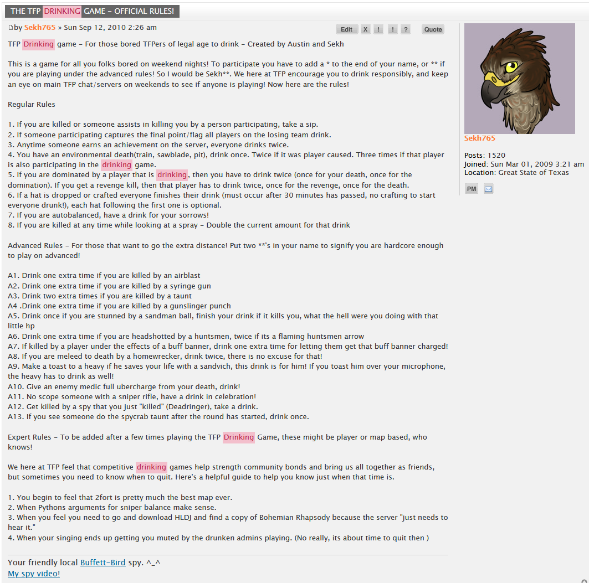

# TF2-Drinking-Plugin
Sourcemod Plugin for TF2 that tells players when to drink based on in-game events

drinkgame.sp is the main plugin
drinkgameTFClassic.sp has been modified to work within TF2 Classic mode

For either, you should only need the .smx file in your server's plugin directory to make it work. If you don't feel comfortable using the precompiled ones here, just grab the .sp and in a copy of Sourcemod run "spcomp drinkgame.sp" to compile your own.

The plugin operates on the number of asterisks at the end of a player's name. This works as follows:
- \* Basic rules: Player must take a drink if another player who is also playing (has any number of asterisks at the end of their name) kills them.
- \*\* Advanced rules: Basic Rules + a bunch of logic to test for special cases in-game like environmental deaths, stuns from sandman, huntsman kills, etc...
- \*\*\* Extreme Mode: All of Advanced rules + removes other player requirement. Thus, any player killing you requires a drink, even if they aren't playing. Generally this is the most fun for all involved.
- \*\*\*\* NikkyVix's Suicide Cirrhosis Mode: Originally a bug, now a feature! Not only operating on Extreme mode, but any time you make someone take a drink, those drinks are also reflected back on you. Guaranteed to be sloshed by the end of the night.

So a player named "Johnny Doe\*" would be playing Basic rules, and a player named "Doomin and Coomin***" would be playing Extreme mode.

Based on the original ruleset:

